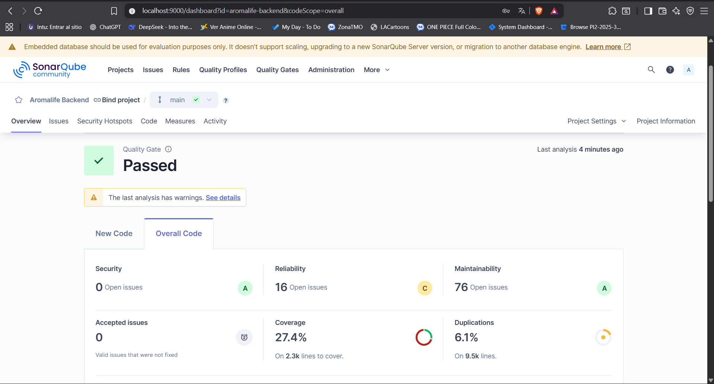
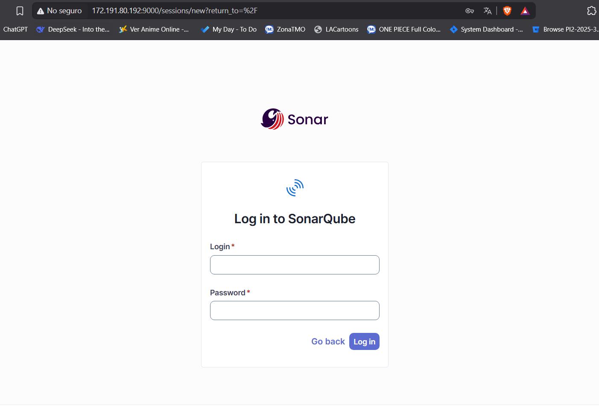
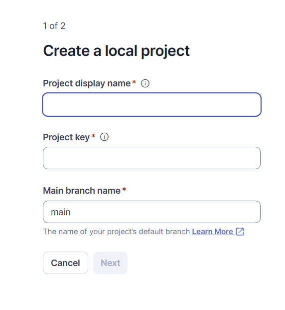
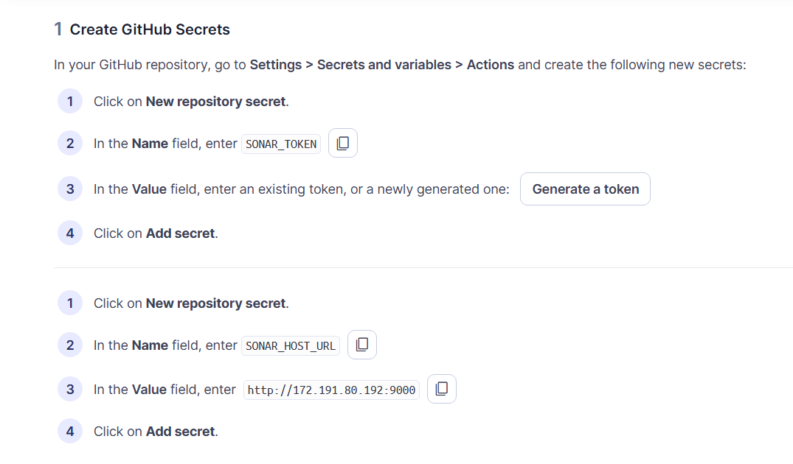
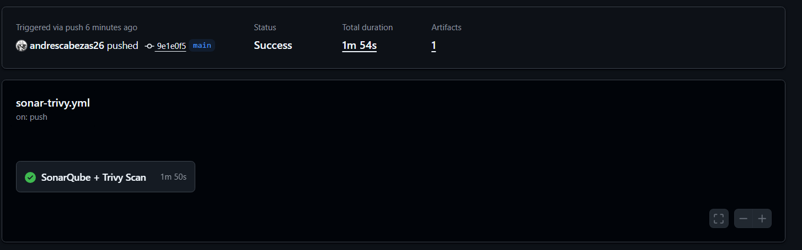
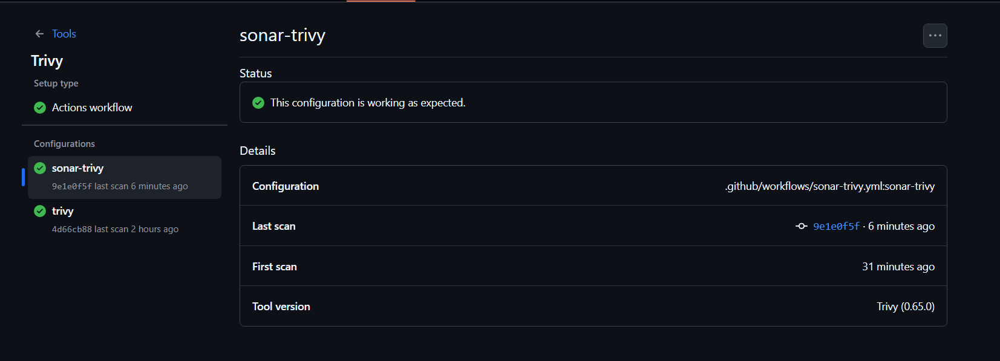
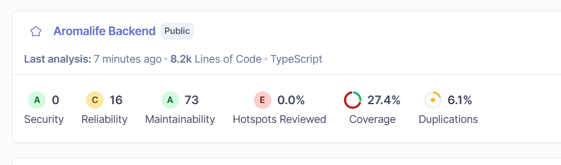

# Aromalife Backend

API backend para la aplicación de velas aromáticas desarrollada con NestJS.


## Parte 1 Configuración de SonarQube Local

Esta sección explica cómo configurar SonarQube localmente para analizar el código del proyecto Aromalife Backend.

### Prerequisitos

- Docker y Docker Compose instalados
- Node.js y npm/yarn
- Proyecto de NestJS configurado

### Configuración Inicial

#### 1. Docker Compose para SonarQube

El proyecto incluye un archivo `docker-compose.sonar.yml` que configura SonarQube con PostgreSQL:

```yaml
version: '3.8'

services:
  sonarqube:
    image: sonarqube:community
    container_name: sonarqube
    ports:
      - "9000:9000"
    networks:
      - sonarnet
    environment:
      - SONARQUBE_JDBC_URL=jdbc:postgresql://db:5432/sonar
      - SONARQUBE_JDBC_USERNAME=sonar
      - SONARQUBE_JDBC_PASSWORD=sonar
    volumes:
      - sonarqube_conf:/opt/sonarqube/conf
      - sonarqube_data:/opt/sonarqube/data
      - sonarqube_extensions:/opt/sonarqube/extensions
      - sonarqube_bundled-plugins:/opt/sonarqube/lib/bundled-plugins
    depends_on:
      - db

  db:
    image: postgres:13
    container_name: sonarqube-db
    networks:
      - sonarnet
    environment:
      - POSTGRES_USER=sonar
      - POSTGRES_PASSWORD=sonar
      - POSTGRES_DB=sonar
    volumes:
      - postgresql:/var/lib/postgresql
      - postgresql_data:/var/lib/postgresql/data

networks:
  sonarnet:
    driver: bridge

volumes:
  sonarqube_conf:
  sonarqube_data:
  sonarqube_extensions:
  sonarqube_bundled-plugins:
  postgresql:
  postgresql_data:
```

#### 2. Archivo de Configuración

El proyecto incluye un archivo `sonar-project.properties` con la configuración específica:

```properties
# Información del proyecto
sonar.projectKey=aromalife-backend
sonar.projectName=Aromalife Backend
sonar.projectVersion=1.0

# Configuración de archivos fuente
sonar.sources=src
sonar.tests=test
sonar.exclusions=**/node_modules/**,**/dist/**,**/*.spec.ts,**/*.e2e-spec.ts

# Configuración de TypeScript
sonar.typescript.lcov.reportPaths=coverage/lcov.info
sonar.javascript.lcov.reportPaths=coverage/lcov.info

# Configuración de cobertura
sonar.coverage.exclusions=**/*.spec.ts,**/*.e2e-spec.ts,**/main.ts,**/*.module.ts

# Configuración del servidor
sonar.host.url=http://localhost:9000
sonar.login=squ_924321008a440a74dd4a4d46db02962e3d764eeb
```

### Pasos para Ejecutar

#### 1. Iniciar SonarQube

```bash
docker-compose -f docker-compose.sonar.yml up -d
```

#### 2. Acceder a SonarQube

1. Abrir el navegador en: http://localhost:9000
2. Credenciales por defecto:
   - Usuario: `admin`
   - Contraseña: `admin`

#### 3. Ejecutar Análisis

Para analizar el código del proyecto, simplemente ejecuta:

```bash
npm run sonar
```

Este comando:
1. Ejecuta las pruebas con cobertura (`npm run test:cov`)
2. Genera el reporte de cobertura en `coverage/lcov.info`
3. Ejecuta SonarQube Scanner para analizar el código

### Resultado

Una vez completado el análisis, podrás ver los resultados en el dashboard de SonarQube:



El dashboard muestra:
- **Quality Gate**: Estado general del proyecto (Passed/Failed)
- **Security**: Vulnerabilidades de seguridad encontradas (0 issues - Rating A)
- **Reliability**: Bugs y issues de confiabilidad (16 issues - Rating C)
- **Maintainability**: Code smells y problemas de mantenibilidad (76 issues - Rating A)
- **Coverage**: Porcentaje de cobertura de código (27.4% en 2.3k líneas)
- **Duplications**: Código duplicado (6.1% en 9.5k líneas)

### Configuración del Proyecto

El archivo `package.json` incluye los scripts necesarios:

```json
{
  "scripts": {
    "sonar": "npm run test:cov && sonar-scanner -Dsonar.token=squ_924321008a440a74dd4a4d46db02962e3d764eeb",
    "sonar:coverage": "npm run test:cov && sonar-scanner"
  }
}
```

### Notas Importantes

- El token de acceso está configurado en el archivo `sonar-project.properties`
- La base de datos embebida es solo para propósitos de evaluación
- Los archivos de prueba están excluidos del análisis de cobertura
- El análisis incluye solo archivos TypeScript del directorio `src`
- El proyecto actualmente tiene un Quality Gate **Passed** con algunas advertencias


## Parte 2: Despliegue de SonarQube en Azure

Para un entorno de producción y permitir el análisis desde GitHub Actions, desplegamos SonarQube en una máquina virtual de Azure usando Terraform.

### Prerequisitos

- Azure CLI instalado y configurado
- Terraform instalado
- Suscripción activa de Azure

### Infraestructura como Código (IaC)

#### 1. Configuración de Terraform

El archivo [`terraform/main.tf`](terraform/main.tf) define toda la infraestructura necesaria:

```hcl
terraform {
  required_providers {
    azurerm = {
      source  = "hashicorp/azurerm"
      version = "~> 3.0"
    }
  }
  required_version = ">= 1.6.0"
}

provider "azurerm" {
  features {}
}

# 1. Grupo de recursos
resource "azurerm_resource_group" "sonarqube_rg" {
  name     = "rg-sonarqube"
  location = var.location
}

# 2. Red virtual y subred
resource "azurerm_virtual_network" "vnet" {
  name                = "sonarqube-vnet"
  address_space       = ["10.0.0.0/16"]
  location            = var.location
  resource_group_name = azurerm_resource_group.sonarqube_rg.name
}

resource "azurerm_subnet" "subnet" {
  name                 = "sonarqube-subnet"
  resource_group_name  = azurerm_resource_group.sonarqube_rg.name
  virtual_network_name = azurerm_virtual_network.vnet.name
  address_prefixes     = ["10.0.1.0/24"]
}

# 3. IP pública
resource "azurerm_public_ip" "public_ip" {
  name                = "sonarqube-ip"
  location            = var.location
  resource_group_name = azurerm_resource_group.sonarqube_rg.name
  allocation_method   = "Static"
  sku                 = "Standard"
}

# 4. Grupo de seguridad de red (NSG)
resource "azurerm_network_security_group" "nsg" {
  name                = "sonarqube-nsg"
  location            = var.location
  resource_group_name = azurerm_resource_group.sonarqube_rg.name

  security_rule {
    name                       = "Allow-SonarQube"
    priority                   = 100
    direction                  = "Inbound"
    access                     = "Allow"
    protocol                   = "Tcp"
    source_port_range          = "*"
    destination_port_range     = "9000"
    source_address_prefix      = "*"
    destination_address_prefix = "*"
  }

  security_rule {
    name                       = "Allow-SSH"
    priority                   = 200
    direction                  = "Inbound"
    access                     = "Allow"
    protocol                   = "Tcp"
    source_port_range          = "*"
    destination_port_range     = "22"
    source_address_prefix      = "*"
    destination_address_prefix = "*"
  }
}

# 7. Máquina Virtual (Ubuntu)
resource "azurerm_linux_virtual_machine" "vm" {
  name                = "vm-sonarqube"
  location            = var.location
  resource_group_name = azurerm_resource_group.sonarqube_rg.name
  size                = "Standard_B2s"
  admin_username      = var.admin_username
  admin_password      = var.admin_password
  disable_password_authentication = false

  network_interface_ids = [azurerm_network_interface.nic.id]

  os_disk {
    caching              = "ReadWrite"
    storage_account_type = "Standard_LRS"
  }

  source_image_reference {
    publisher = "Canonical"
    offer     = "0001-com-ubuntu-server-focal"
    sku       = "20_04-lts-gen2"
    version   = "latest"
  }

  custom_data = filebase64("setup-sonarqube.sh")
}

# 8. Salidas
output "sonarqube_public_ip" {
  value = azurerm_public_ip.public_ip.ip_address
}
```

#### 2. Variables de Terraform

El archivo [`terraform/variables.tf`](terraform/variables.tf):

```hcl
variable "location" {
  description = "Región de Azure"
  type        = string
  default     = "eastus"
}

variable "admin_username" {
  description = "Usuario administrador de la VM"
  type        = string
  default     = "azureuser"
}

variable "admin_password" {
  description = "Contraseña para la VM"
  type        = string
  default     = "Aromalife@2025#dev"
}
```

#### 3. Script de Configuración

El archivo [`terraform/setup-sonarqube.sh`](terraform/setup-sonarqube.sh) configura automáticamente SonarQube:

```bash
#!/bin/bash
sudo apt update -y
sudo apt install -y docker.io docker-compose

# Crear carpeta de SonarQube
mkdir -p /opt/sonarqube
cd /opt/sonarqube

# Crear docker-compose
cat <<EOF > docker-compose.yml
version: '3.3'

services:
  sonarqube:
    image: sonarqube:community
    container_name: sonarqube
    ports:
      - "9000:9000"
    environment:
      - SONARQUBE_JDBC_URL=jdbc:postgresql://db:5432/sonar
      - SONARQUBE_JDBC_USERNAME=sonar
      - SONARQUBE_JDBC_PASSWORD=sonar
    volumes:
      - sonarqube_data:/opt/sonarqube/data
      - sonarqube_extensions:/opt/sonarqube/extensions
    depends_on:
      - db
    restart: always

  db:
    image: postgres:13
    container_name: sonarqube-db
    environment:
      - POSTGRES_USER=sonar
      - POSTGRES_PASSWORD=sonar
      - POSTGRES_DB=sonar
    volumes:
      - postgresql_data:/var/lib/postgresql/data
    restart: always

volumes:
  sonarqube_data:
  sonarqube_extensions:
  postgresql_data:
EOF

# Levantar los contenedores
sudo docker-compose up -d
```

### Pasos de Despliegue

#### 1. Preparar el entorno

```bash
# Clonar el repositorio
git clone <tu-repositorio>
cd proyecto-backend

# Navegar al directorio de Terraform
cd terraform
```

#### 2. Inicializar Terraform

```bash
terraform init
```

#### 3. Planificar el despliegue

```bash
terraform plan
```

#### 4. Aplicar la infraestructura

```bash
terraform apply
```

#### 5. Obtener la IP pública

```bash
terraform output sonarqube_public_ip
```

#### 6. Verificar el despliegue

Una vez completado, puedes acceder a SonarQube en:
- URL: `http://<IP_PUBLICA>:9000`
- Usuario: `admin`
- Contraseña: `admin`

### Configuración Post-Despliegue

#### 1. Cambiar contraseña por defecto
- Acceder a SonarQube con las credenciales por defecto
- Ir a **Administration > Security > Users**
- Cambiar la contraseña del usuario admin

#### 2. Crear proyecto para el backend
- Ir a **Projects > Create Project**
- Seleccionar **Manually**
- Project key: `aromalife-backend`
- Display name: `Aromalife Backend`



#### 3. Generar token de acceso
- Ir a **My Account > Security**
- Generar nuevo token con nombre: `github-actions`
- Guardar el token de forma segura



---

### Configuración de CI/CD con GitHub Actions

Implementamos un pipeline de CI/CD que integra SonarQube y Trivy para análisis de código y seguridad.

### Configuración de Secretos en GitHub

Para que el pipeline funcione correctamente, necesitas configurar los siguientes secretos en tu repositorio de GitHub:

#### 1. Acceder a la configuración de secretos
- Ve a tu repositorio en GitHub
- Click en **Settings**
- En el menú lateral, click en **Secrets and variables > Actions**

#### 2. Agregar los secretos necesarios

| Nombre del Secreto | Descripción | Valor de Ejemplo |
|-------------------|-------------|------------------|
| `SONAR_TOKEN` | Token de autenticación de SonarQube | `squ_1234567890abcdef...` |
| `SONAR_HOST_URL` | URL del servidor SonarQube en Azure | `http://172.191.80.192:9000` |

#### 3. Obtener el token de SonarQube
1. Accede a tu instancia de SonarQube: `http://<IP_PUBLICA>:9000`
2. Login con tus credenciales
3. Ve a **My Account > Security**
4. Genera un nuevo token:
   - Name: `github-actions`
   - Type: `User Token`
   - Expires in: `No expiration` (o según tus políticas)
5. Copia el token generado y agrégalo como `SONAR_TOKEN` en GitHub

### Pipeline de CI/CD

El archivo [`.github/workflows/sonar-trivy.yml`](.github/workflows/sonar-trivy.yml) define nuestro pipeline:

```yaml
name: CI/CD - SonarQube + Trivy

on:
  push:
    branches:
      - main
      - develop
  pull_request:

permissions:
  contents: read 
  security-events: write
  actions: read 

jobs:
  sonar-trivy:
    name: SonarQube + Trivy Scan
    runs-on: ubuntu-latest

    env:
      SONAR_HOST_URL: ${{ secrets.SONAR_HOST_URL }}
      SONAR_TOKEN: ${{ secrets.SONAR_TOKEN }}

    steps:
      # 1️⃣ Checkout del código
      - name: Checkout code
        uses: actions/checkout@v3

      # 2️⃣ Configurar Node.js
      - name: Setup Node.js
        uses: actions/setup-node@v3
        with:
          node-version: '20'

      # 3️⃣ Instalar dependencias
      - name: Install dependencies
        run: npm install

      # 4️⃣ Ejecutar pruebas con cobertura
      - name: Run tests with coverage
        run: npm run test:cov
        continue-on-error: true

      # 5️⃣ Instalar SonarQube Scanner
      - name: Install Sonar Scanner
        run: npm install -g sonarqube-scanner

      - name: Check Sonar Scanner version
        run: sonar-scanner --version

      # 6️⃣ Ejecutar análisis de SonarQube
      - name: SonarQube Scanner
        env:
          SONAR_TOKEN: ${{ secrets.SONAR_TOKEN }}
          SONAR_HOST_URL: ${{ secrets.SONAR_HOST_URL }}
        run: |
          sonar-scanner \
            -Dsonar.host.url=$SONAR_HOST_URL \
            -Dsonar.token=$SONAR_TOKEN \
            -Dsonar.projectKey=aromalife-backend \
            -Dsonar.security.report.export.path=trivy-results.sarif

      # 7️⃣ Análisis de seguridad con Trivy (SARIF)
      - name: 📥 Checkout code
        uses: actions/checkout@v4
        with:
          fetch-depth: 0

      - name: 🔍 Run Trivy vulnerability scanner (Filesystem)
        uses: aquasecurity/trivy-action@master
        with:
          scan-type: "fs"
          scan-ref: "."
          format: "sarif"
          output: "trivy-results.sarif"
          severity: "CRITICAL,HIGH"
          exit-code: "0" # No fallar el build por vulnerabilidades

      # 8️⃣ Subir resultados a GitHub Security
      - name: 📊 Upload Trivy results to GitHub Security
        uses: github/codeql-action/upload-sarif@v3
        if: always()
        continue-on-error: true
        with:
          sarif_file: "trivy-results.sarif"

      # 9️⃣ Generar reporte JSON de Trivy
      - name: 🔍 Run Trivy vulnerability scanner (JSON report)
        uses: aquasecurity/trivy-action@master
        with:
          scan-type: "fs"
          scan-ref: "."
          format: "json"
          output: "trivy-report.json"
          severity: "CRITICAL,HIGH,MEDIUM"

      # 🔟 Subir artefactos
      - name: 📤 Upload Trivy JSON report
        uses: actions/upload-artifact@v4
        if: always()
        with:
          name: trivy-security-report
          path: trivy-report.json
          retention-days: 30
```

### Características del Pipeline

#### ✅ **Análisis de Calidad de Código (SonarQube)**
- Ejecuta análisis estático de código
- Mide cobertura de pruebas
- Detecta code smells y bugs
- Evalúa mantenibilidad del código
- Genera Quality Gate automático

#### 🔒 **Análisis de Seguridad (Trivy)**
- Escanea vulnerabilidades en dependencias
- Detecta secretos hardcodeados
- Analiza configuraciones inseguras
- Genera reportes SARIF para GitHub Security
- Categoriza vulnerabilidades por severidad

#### 📊 **Reportes y Artefactos**
- Integración con GitHub Security tab
- Reportes JSON descargables
- Retención de artefactos por 30 días
- Integración con SonarQube dashboard

### Configuración del Jest para Cobertura

El archivo [`jest.config.js`](jest.config.js) está configurado para generar reportes de cobertura:

```javascript
module.exports = {
  moduleFileExtensions: ['js', 'json', 'ts'],
  rootDir: '.',
  testRegex: '.*\\.spec\\.ts$',
  transform: {
    '^.+\\.(t|j)s$': 'ts-jest',
  },
  collectCoverageFrom: [
    '**/*.service.ts',
    '**/*.controller.ts',
  ],
  coverageDirectory: './coverage',
  testEnvironment: 'node',
  moduleNameMapper: {
    '^@/(.*)$': '<rootDir>/src/$1',
  },
  reporters: [
    'default',
    ['jest-junit', {
      outputDirectory: './test-results',
      outputName: 'junit.xml',
      suiteName: 'jest tests',
      classNameTemplate: '{classname}',
      titleTemplate: '{title}',
      ancestorSeparator: ' > ',
      usePathForSuiteName: true
    }]
  ]
};
```

### Trigger del Pipeline

El pipeline se ejecuta automáticamente en los siguientes casos:

- **Push** a las ramas `main` o `develop`
- **Pull Requests** hacia cualquier rama
- **Manualmente** desde la pestaña Actions de GitHub

### Monitoreo y Resultados

#### 1. **GitHub Actions**
- Ve a la pestaña **Actions** en tu repositorio
- Revisa el estado de cada ejecución del pipeline
- Descarga artefactos y reportes generados




#### 2. **GitHub Security**
- Ve a la pestaña **Security** de tu repositorio
- Revisa vulnerabilidades detectadas por Trivy
- Gestiona alertas de seguridad




#### 3. **SonarQube Dashboard**
- Accede a: `http://<IP_PUBLICA>:9000`
- Revisa métricas de calidad de código
- Analiza tendencias y cobertura



### Beneficios del Pipeline

✅ **Automatización completa**: Análisis automático en cada cambio
✅ **Calidad de código**: Detección temprana de problemas
✅ **Seguridad**: Identificación de vulnerabilidades
✅ **Reportes centralizados**: Toda la información en GitHub
✅ **Integración nativa**: Funciona con el flujo de trabajo de GitHub
✅ **Escalabilidad**: Fácil de extender con nuevas herramientas

### Troubleshooting

#### Problemas comunes y soluciones:

1. **Error de conexión a SonarQube**
   - Verificar que `SONAR_HOST_URL` sea correcto
   - Confirmar que el puerto 9000 esté abierto
   - Verificar que SonarQube esté ejecutándose

2. **Token inválido**
   - Regenerar token en SonarQube
   - Actualizar el secreto `SONAR_TOKEN` en GitHub

3. **Fallas en las pruebas**
   - Revisar logs del step "Run tests with coverage"
   - Verificar dependencias en [`package.json`](package.json)

4. **Problemas con Trivy**
   - Revisar permisos de seguridad en el repositorio
   - Verificar que GitHub Advanced Security esté habilitado (para repos privados)

---

## Conclusión

Este setup proporciona una solución completa de CI/CD que incluye:

- ✅ **Análisis de calidad de código** con SonarQube
- ✅ **Análisis de seguridad** con Trivy  
- ✅ **Infraestructura como código** con Terraform
- ✅ **Automatización completa** con GitHub Actions
- ✅ **Reportes centralizados** en GitHub y SonarQube

La configuración es escalable y puede adaptarse fácilmente para incluir nuevas herramientas de análisis, despliegue automático, y otras prácticas de DevOps.
